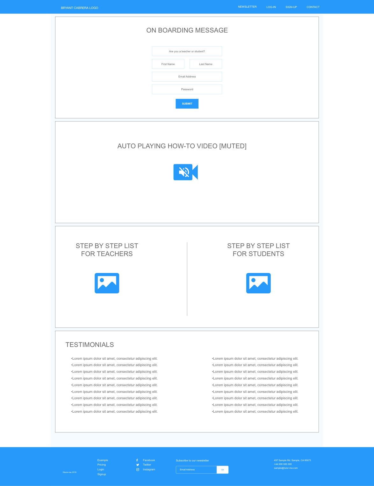
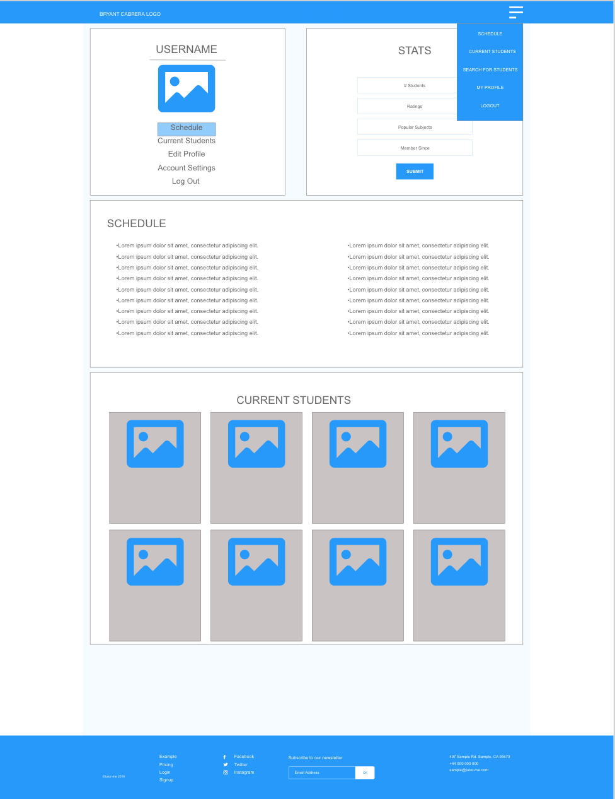
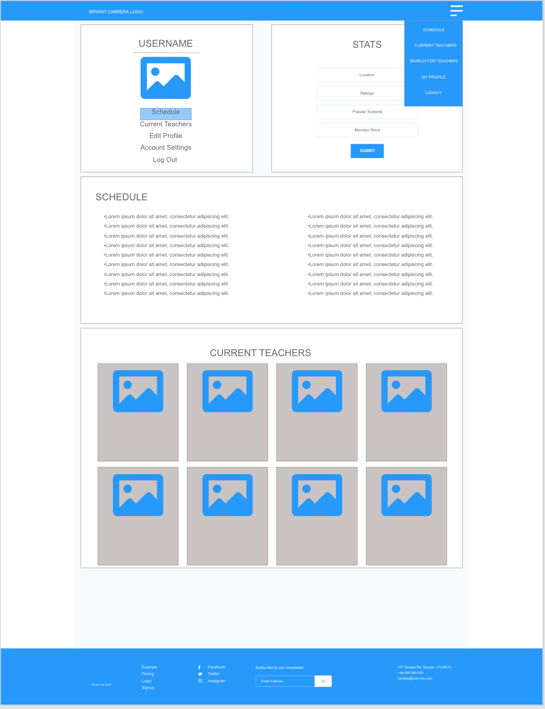
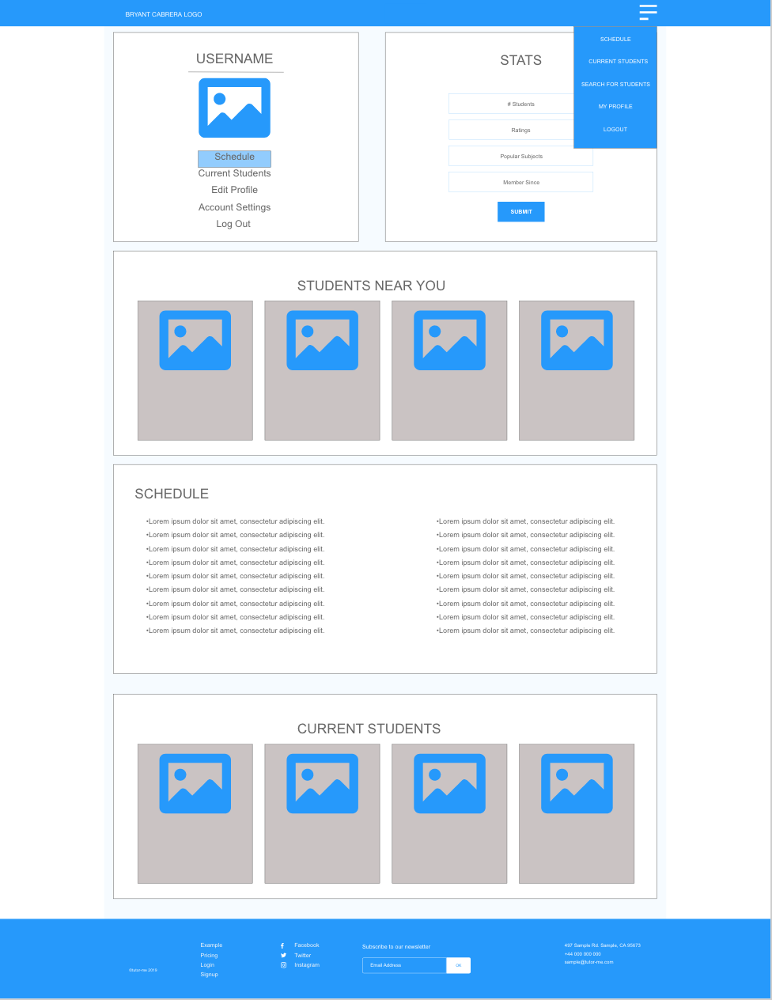
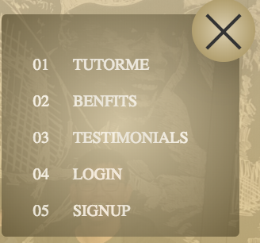
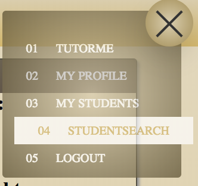

# Bryant Cabrera's tutor-me

### A. Description
Bryant Cabrera's TutorMe app is a web-based application which aims to facilitate connections and scheduling between tutors and potential students.  As a private tutor by trade, I wanted to create an app that was a one-stop-shop for all of my scheduling and roster needs.

Link to User Stories: [Link to TutorMe User Stories](https://github.com/BryantCabrera/tutor-me/blob/master/user-stories.md).

### B. Images
1. Wireframe
    1. Image of Overall Wireframe
    
    2. Image of Tutor Section Wireframe
    
    3. Image of Student Section Wireframe
    
    4. Image of Locate Student/Tutor Section Wireframe
    
2. NavBar
    1.  No user logged in
    
    2.  User logged in
    

### C. Technologies Used
1. HTML
    1. Block__Element--Method (BEM) class naming methodology
2. CSS
3. Sass
3. JavaScript
4. jQuery
5. Express
6. Node
7. MongoDB
8. Mongoose
9. IonIcons
10. Google API
    1. Geocoder
    2. Places
    3. Routes
    4. Maps
11. Adobe Illustrator, Photoshop, XD
12. Final Cut Pro X
13. Compressor

### D. Getting Started
1. Link to deployed app on Heroku:
[GitHub Pages Deployed App](https://bryantcabrera.github.io/tutor-me/#)
2. Instructions
    1. Connect to a databse sandbox of your choice.  I used mlab.com and created a sandbox user account so I could populate my app with data.
    2. In the db.js file in the db folder, make sure the connectionString variable is set to your database connection.
    3. Once you are connected to your database, open the app by clicking the link above.
    4. To Create a user: 
        1. Select the proper account type.  
        2. Fill out all required fields (marked with an *) and click "register"
    5. To Edit your profile:
        1. Navigate to your profile.
        2. Hover over your profile card and click "Edit".
        
        3. Edit the information you want and click "Submit."
        
    6. To Delete your profile:
        1. Navigate to your profile.
        2. Hover over your profile card and click "Edit".
        3. Click the "Delete" button.
        
        4. This will delete your profile, log you out, and delete your data from your students'/tutors' data model/profile page.
    7. If you're a student, to add a tutor to your profile:
        1. Navigate to your desired tutor's profile. (You can get there by clicking the navbar and clicking "Search Tutors").
        2. Hover over his/her/their profile card and click "Add Tutor".
        
        3. This will add the tutor to your data model and profile page and vice versa.
    8. For any account, to add a comment to anyone's profile:
        1. Navigate to your desired tutor's profile.
        2. Scroll to the bottom of his/her/their profile page to the section titled "Feedback."
        
        3. Type in your comment and click "Submit Comment".
    9. To Log In: 
        1. Click the hamburger menu and click "Log In".
        2. Select your account type.
        3. Type in the email address and password you used to create your account.
        4. Click the "Log In" button.
    10. To log out: Click the hamburger menu and click "Log Out".

### E. Next Steps
1. Unsolved problems
    - [ ] Once logged in, a user can still access other user's edit pages by typing "/edit" after the other profile page's show route url.  I will need to create an if statement using sessions to block access to that particular route from anyone except the account's owner. 
    - [ ] Update route incorrectly handles addition of information to subjects property
2. Planned features
    - [ ] Connect scheduling API with intuitive user interface that updates data models' availability property
    - [ ] Comments
        - [ ] Display link to poster
        - [ ] On poster's profile, display written comments with link to postee
        - [ ] Make comments Editable
        - [ ] Make comments Deletable
        - [ ] Style comments
    - [ ] Hide registration/login form when a user is logged in but goes to the home page.